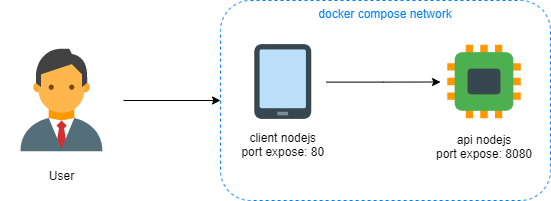

## Ejemplo Simple de Docker Compose

## Requisitos
* git
* docker
* docker compose

# Diagrama

Esta configuracion de docker compose crea y lanza dos imagenes, cada una de las imagenes contienes un sewrvicio de node js que eponen una api y un cliente de nodejs.


# Ejecucion y pruebas

Compilar las imagenes
```
docker-compose build
```

Lanzar los contenedores y la configuracion de red
Compilar las imagenes
```
docker-compose up -d
```

Navegar a la ruta del cliente nodejs
```
http://localhost/
```

Navegar a la ruta del api nodejs
```
http://localhost:8080/
```

Bajar los contenedores y eliminarlos
```
docker-compose down
```
